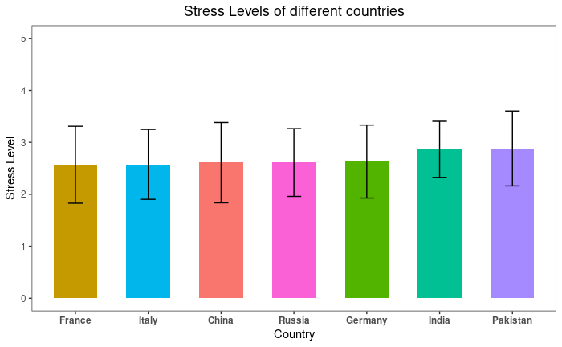
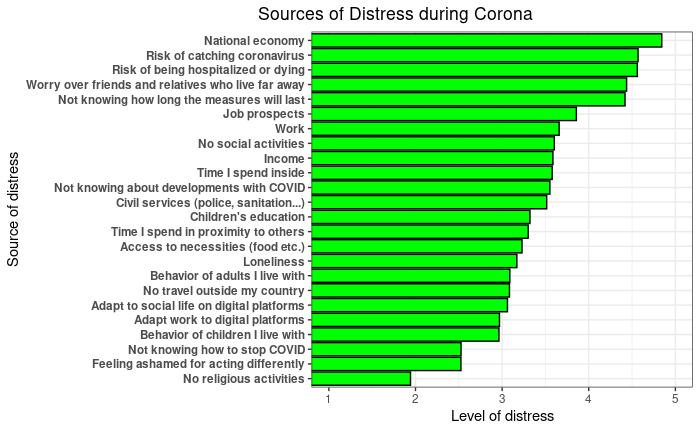
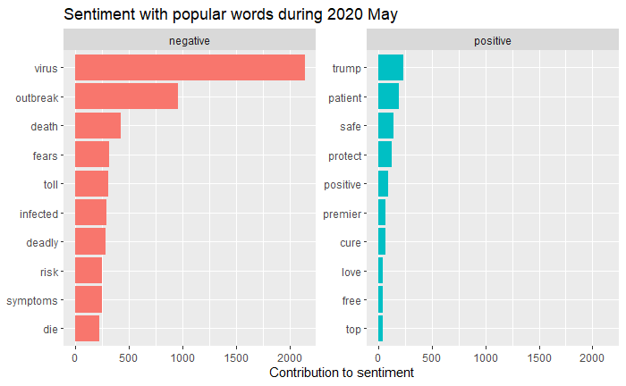
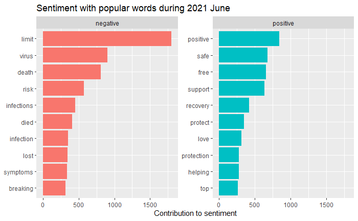
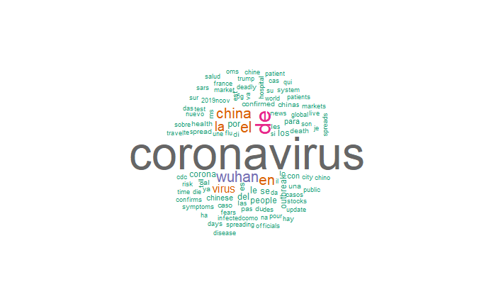
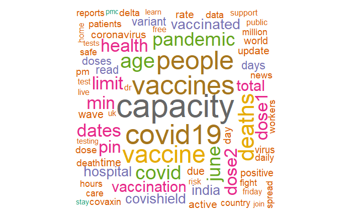

<div align="center">

# Psychological & Behavioural Distress of COVID-19 & Infodemics


[](LICENSE)
[](https://www.r-project.org/)
[](https://covid-distress-infodemics.shinyapps.io/shinyapp/)
[](https://rpubs.com/ranjiraj9/covidistress)

*Analysing the psychological and behavioural impact of the COVID-19 pandemic — stress, anxiety, trust in institutions, and social media infodemics — using R.*

</div>

---

## Table of Contents

- [Overview](#overview)
- [Key Findings](#key-findings)
- [Datasets](#datasets)
- [Project Structure](#project-structure)
- [Process Notebook](#process-notebook)
- [Shiny Web App](#shiny-web-app)
- [Screencast](#screencast)
- [Getting Started](#getting-started)
- [Contributors](#contributors)
- [License](#license)

---

## Overview

The COVID-19 pandemic is an unprecedented health crisis that has impacted the world to a large extent. According to the WHO, mental disorders are among the leading causes of disability worldwide, and the pandemic has further compounded mental health challenges. Stress, anxiety, and depression — stemming from fear, isolation, and stigma — have affected all of us in one way or another, with widespread job losses and elderly populations isolated from their support networks.

Measures taken to slow the spread of the virus have also affected physical activity, eating behaviours, sleep patterns, and our relationship with addictive substances — including social media. Increased social media usage during lockdowns, combined with constant exposure to disaster news, has amplified negative effects on mental well-being.

This project performs diagnostic analysis of these patterns and derives meaningful insights from three complementary data sources:

| Objective | Data Source | Methods |
|-----------|-------------|---------|
| Stress & coping analysis | COVIDiSTRESS global survey | Descriptive statistics, correlation analysis |
| Public sentiment tracking | Twitter (2020 & 2021) | NLP, sentiment analysis, word clouds |
| Trust & infodemics | COVID-19 Infodemics Observatory | IRI index analysis, regression modelling |

---

## Key Findings

<table>
<tr>
<td width="50%">

**Stress Levels Across Countries**



</td>
<td width="50%">

**Sources of Distress**



</td>
</tr>
<tr>
<td width="50%">

**Tweet Sentiment Analysis (2020)**



</td>
<td width="50%">

**Tweet Sentiment Analysis (2021)**



</td>
</tr>
<tr>
<td width="50%">

**Word Cloud (2020)**



</td>
<td width="50%">

**Word Cloud (2021)**



</td>
</tr>
</table>

> See the full analysis in the [Process Notebook](https://rpubs.com/ranjiraj/covidistress).

---

## Datasets

<details>
<summary><strong>1. COVIDiSTRESS Global Survey</strong></summary>

An open science collaboration created by researchers in over 40 countries to collect data on human experiences during the 2020 coronavirus epidemic.

> COVIDiSTRESS global survey network (2020, March 30). COVIDiSTRESS global survey. DOI [10.17605/OSF.IO/Z39US](https://osf.io/z39us/)

Covers stress levels, sources of stress, trust in institutions across the EU, loneliness, media use, personality traits, social provisions, and perceived sources of psychological relief.

</details>

<details>
<summary><strong>2. Twitter Data</strong></summary>

COVID-19 related tweets collected using [`twitteR`](https://www.rdocumentation.org/packages/twitteR/versions/1.1.9) and [`rtweet`](https://www.rdocumentation.org/packages/rtweet/versions/0.7.0) R packages for sentiment analysis.

- **2020 data**: Academic dataset of tweet IDs from [Zenodo](https://zenodo.org/record/3831406)
- **2021 data**: Collected directly via the Twitter API

</details>

<details>
<summary><strong>3. COVID-19 Infodemics Observatory</strong></summary>

Examines the role of trust and information during the pandemic and infodemic.

> R. Gallotti, N. Castaldo, F. Valle, P. Sacco and M. De Domenico, COVID19 Infodemics Observatory (2020). DOI: [10.17605/OSF.IO/N6UPX](https://osf.io/n6upx/)
>
> Van Mulukom, V. (2021, May 15). The Role of Trust and Information during the COVID-19 Pandemic and Infodemic. DOI: [10.17605/OSF.IO/GFWBQ](https://doi.org/10.17605/OSF.IO/GFWBQ)

Sources: [osf.io/n6upx](https://osf.io/n6upx/) · [osf.io/67zhg](https://osf.io/67zhg/) · [osf.io/rtacb](https://osf.io/rtacb/) · [osf.io/dh879](https://osf.io/dh879/) · [osf.io/c37wq](https://osf.io/c37wq/)

Includes infodemics summary data, the World Risk Index, population emotional state, and news reliability indicators.

</details>

> **Note:** Very large files in this repository are tracked via [Git LFS](https://git-lfs.github.com/).

---

## Project Structure

```
.
├── data/                        # Raw datasets (.csv, .sav)
├── files/                       # Logo and miscellaneous assets
├── process-nbk/
│   ├── data/                    # Processed data files
│   ├── fig/                     # Generated figures (.png, .jpg)
│   └── scripts/                 # Analysis scripts (.R, .Rmd)
├── process_notebook_final/      # Final process notebook (.Rmd)
├── project_proposal/            # Project proposal documentation
├── shinyapp/                    # Shiny web application source code
├── .gitignore
├── LICENSE
└── README.md
```

---

## Process Notebook

The full process notebook is published on RPubs:

**[View Process Notebook on RPubs](https://rpubs.com/ranjiraj9/covidistress)**

> *Tip: Click "Hide Toolbars" at the bottom-right corner of RPubs for a cleaner reading experience.*

The source code for the notebook is available [here](https://github.com/ranjiGT/Data-Science-with-R-2021/blob/main/process_notebook_final/ultimate-process-notebook.Rmd).

---

## Shiny Web App

An interactive dashboard built with R Shiny to explore the data and findings:

<div align="center">

**[Launch the App](https://covid-distress-infodemics.shinyapps.io/shinyapp/)**

</div>

To run the app locally from RStudio:

```r
library(shiny)
runApp("shinyapp")
```

---

## Screencast

<div align="center">

[](https://youtu.be/b2b1hFEGxa8)

*Click the image above to watch the project walkthrough on YouTube.*

</div>

---

## Getting Started

### Prerequisites

- [R](https://cran.r-project.org/) (>= 4.0)
- [RStudio](https://posit.co/download/rstudio-desktop/) (recommended)
- [Git LFS](https://git-lfs.github.com/) (for large data files)

### Installation

1. Clone the repository:
   ```bash
   git lfs install
   git clone https://github.com/ranjiGT/Data-Science-with-R-2021.git
   cd Data-Science-with-R-2021
   ```

2. Open `Data-Science-with-R-2021.Rproj` in RStudio.

3. Install required R packages (listed in individual scripts).

---

## Contributors

<table>
<tr>
<td align="center"><a href="https://github.com/ranjiGT"><br /><sub><b>Ranji Raj</b></sub></a></td>
<td align="center"><a href="https://github.com/madhurisajith"><br /><sub><b>Madhuri Sajith</b></sub></a></td>
<td align="center"><a href="https://github.com/VishnuJayanand"><br /><sub><b>Vishnu Jayanand</b></sub></a></td>
<td align="center"><a href="https://github.com/aaashfaq"><br /><sub><b>Usama Ashfaq</b></sub></a></td>
<td align="center"><a href="https://github.com/sujithnsudhakar"><br /><sub><b>Sujith NS</b></sub></a></td>
</tr>
</table>

---

## License

This project is licensed under the [MIT License](LICENSE).

---

## Course

This project (Team #6) was developed as part of the [Data Science with R](https://brain.cs.uni-magdeburg.de/kmd/DataSciR/) course at Otto von Guericke University Magdeburg, 2021.

| # | Team Members | Title | Presented |
|---|-------------|-------|-----------|
| 1 | Diana Guzman, Philipp Blüml | Analysis of Finance-related Reddit Communities | Fri, 09.07 |
| 2 | Anish Kumar Singh, Priyanka Singh, Ramanpreet Kaur, Venkata Srinath Mannam | Classifying Whether Twitter Authors Spread Hate Using Supervised Learning | Fri, 09.07 |
| 3 | Kiran Babu Thatha, Marcel Schulte, Obinna Patrick Nkwocha, Shweta Pandey, Thorben Hebbelmann | Multi-Perspective and Predictive Analysis of Forests | Fri, 09.07 |
| 4 | Ammar Ateeq, Muhammad Hashim Naveed, Sidra Aziz | Effect of COVID-19 Induced Lockdown on Mental Wellbeing | Fri, 09.07 |
| 5 | Indrani Sarkar, Indranil Maji, Michael Thane, Sharanya Hunasamaranahalli Thotadarya | Trends in Programming Language Popularity | Fri, 09.07 |
| **6** | **Madhuri Sajith, Usama Ashfaq, Vishnu Jayanand, Sujith Nyarakkad Sudhakaran, Ranjiraj Rajendran Nair** | **Behavioral and Psychological Distress of COVID-19 and Infodemics** | **Mon, 12.07** |
| 7 | Jannik Greif, Kolja Günther, Frank Dreyer | The Impact of NBA Player-related Social Media Posts on Their On-court Performance | Fri, 16.07 |
